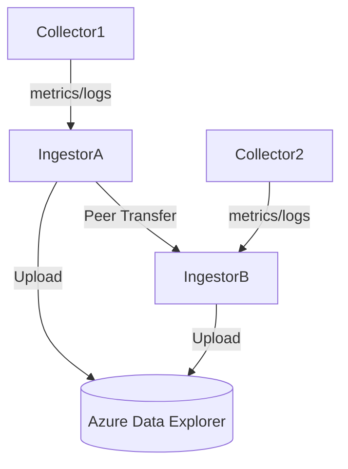
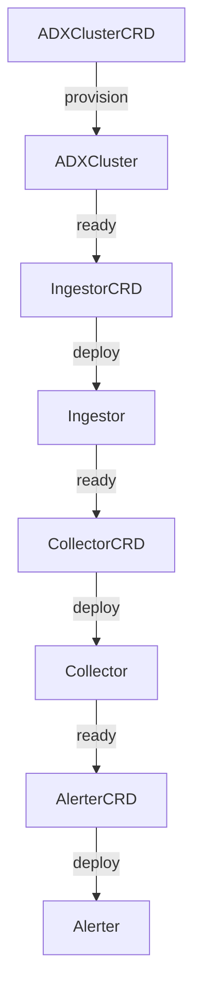

# Concepts

## Overview

ADX-Mon is a fully managed observability solution that supports metrics, logs and traces in a unified stack.
The entrypoint to ADX-Mon is the `collector` which is deployed as a daemonset in your Kubernetes cluster.

The collector is responsible for collecting metrics, logs and traces from your Kubernetes cluster and sending
them to the `ingestor` endpoint which handles the ingestion of data into Azure Data Explorer (ADX).

All collected data is translated to ADX tables.  Each table has a consistent schema that can be extended through
[`update policies`](https://learn.microsoft.com/en-us/azure/data-explorer/kusto/management/updatepolicy) to pull
commonly used labels and attributes up to top level columns.

These tables are all queried with [KQL](https://learn.microsoft.com/en-us/azure/data-explorer/kusto/query/).  KQL
queries are used for analysis, alerting and visualization.

## Components

### Collector

The **Collector** is the entrypoint for telemetry collection in ADX-Mon. It is typically deployed as a DaemonSet on every node in your Kubernetes cluster, where it collects metrics, logs, and traces from the local node and forwards them to the Ingestor for aggregation and storage in Azure Data Explorer (ADX).

#### Key Features
- **Multi-Source Telemetry Collection:** Collects from Prometheus endpoints, logs (including OTLP and host logs), and traces.
- **Kubernetes Native:** Discovers pods and services to scrape via annotations (e.g., `adx-mon/scrape: "true"`).
- **Configurable via TOML:** Uses a TOML config file (see `docs/config.md`) for flexible setup of scrape targets, filters, exporters, and storage.
- **Efficient Buffering:** Uses a Write-Ahead Log (WAL) to buffer data locally for reliability and performance.
- **Label/Attribute Lifting:** Supports lifting selected labels/attributes to top-level columns for easier querying in ADX.
- **Filtering:** Supports regex-based keep/drop rules for metrics and labels, and attribute-based log filtering.
- **Exporters:** Can forward telemetry to additional endpoints (e.g., OTLP, Prometheus remote write) in parallel with ADX.
- **Health & Metrics:** Exposes Prometheus metrics for collector health, WAL status, and scrape/export stats.

#### Configuration & Usage
- **Deployment:** Usually managed by the adx-mon Operator via the `Collector` CRD, or deployed as a DaemonSet.
- **Config File:** Main configuration is via a TOML file (see `docs/config.md` for all options and examples). Key fields include:
  - `endpoint`: Ingestor URL to send telemetry to.
  - `storage-dir`: Directory for WAL and log cursors.
  - `prometheus-scrape`: Prometheus scrape settings (interval, targets, filters).
  - `prometheus-remote-write`: Accepts Prometheus remote write protocol.
  - `otel-log`/`otel-metric`: Accepts OTLP logs/metrics.
  - `host-log`: Collects host and kernel logs.
  - `exporters`: Additional telemetry destinations.
- **Kubernetes Annotations:**
  - `adx-mon/scrape`: Enables scraping for a pod/service.
  - `adx-mon/port`, `adx-mon/path`: Configure scrape port/path. Port can be numeric (e.g., "8080") or named (e.g., "metrics").
  - `adx-mon/targets`: Comma-separated list of path:port combinations. Supports named ports.
  - `adx-mon/log-destination`: Sets log destination table.
  - `adx-mon/log-parsers`: Comma-separated list of log parsers (e.g., `json`).

#### Example Collector CRD
```yaml
apiVersion: adx-mon.azure.com/v1
kind: Collector
metadata:
  name: prod-collector
spec:
  image: "ghcr.io/azure/adx-mon/collector:v1.0.0"
  ingestorEndpoint: "http://prod-ingestor.monitoring.svc.cluster.local:8080"
```

#### Example Config Snippet
```toml
endpoint = 'https://ingestor.adx-mon.svc.cluster.local'
storage-dir = '/var/lib/adx-mon'
region = 'eastus'

[prometheus-scrape]
  database = 'Metrics'
  scrape-interval = 10
  scrape-timeout = 5
  drop-metrics = ['^kube_pod_ips$', 'etcd_grpc.*']
  keep-metrics = ['nginx.*']

[[prometheus-scrape.static-scrape-target]]
  host-regex = '.*'
  url = 'http://localhost:9090/metrics'
  namespace = 'monitoring'
  pod = 'host-monitor'
  container = 'host-monitor'
```

#### How It Works
1. **Discovery:** Finds pods/services to scrape based on annotations and static config.
2. **Scraping/Collection:** Collects metrics, logs, and traces from configured sources.
3. **Buffering:** Writes data to local WAL for reliability and batching.
4. **Forwarding:** Sends batches to the Ingestor, which aggregates and uploads to ADX.
5. **Exporting:** Optionally forwards telemetry to additional endpoints (e.g., OTLP, remote write).
6. **Health Monitoring:** Exposes `/metrics` for Prometheus scraping and tracks WAL/export status.

#### Development & Testing
- Configurable for local or in-cluster testing.
- See `docs/config.md` for all config options and advanced usage.

---

### Ingestor

The **Ingestor** is the aggregation and buffering point for all telemetry collected by ADX-Mon. It receives metrics, logs, and traces from Collectors, batches and stores them using a Write-Ahead Log (WAL), and uploads them to Azure Data Explorer (ADX) in optimized batches. The ingestor is designed for high-throughput, reliability, and efficient use of ADX resources.

#### Key Features
- **WAL-Based Buffering:** All incoming telemetry is written to disk in an append-only WAL for durability and efficient batching.
- **Batching & Coalescing:** Segments are batched by table/schema and uploaded to ADX in large, compressed batches (100MB–1GB recommended) to optimize ingestion cost and performance.
- **Peer Transfer:** Small segments are transferred to peer ingestors for coalescing, reducing the number of small files ingested by ADX.
- **Direct Upload Fallback:** If a segment is too old or too large, it is uploaded directly to ADX, bypassing peer transfer.
- **Multi-Database Support:** Can upload to multiple ADX databases (e.g., metrics, logs) simultaneously.
- **Kubernetes Native:** Deployed as a StatefulSet, supports scaling and partitioning.
- **CRD-Driven:** Managed via the `Ingestor` CRD for declarative configuration.
- **Health & Metrics:** Exposes Prometheus metrics for WAL, batching, upload, and transfer status.

#### Configuration & Usage
- **Deployment:** Usually managed by the adx-mon Operator via the `Ingestor` CRD, or deployed as a StatefulSet.
- **Config File/CLI:** Main configuration is via CLI flags or environment variables (see `cmd/ingestor/main.go`). Key options include:
  - `--storage-dir`: Directory for WAL segments.
  - `--metrics-kusto-endpoints`, `--logs-kusto-endpoints`: ADX endpoints for metrics/logs (format: `<db>=<endpoint>`).
  - `--cluster-labels`: Labels used to identify and distinguish ingestor clusters (format: `<key>=<value>`). Used for `<key>` substitutions in SummaryRules.
  - `--uploads`: Number of concurrent uploads.
  - `--max-segment-size`, `--max-segment-age`: Segment batching thresholds.
  - `--max-transfer-size`, `--max-transfer-age`: Peer transfer thresholds.
  - `--disable-peer-transfer`: Disable peer transfer (upload all segments directly).
  - `--partition-size`: Number of nodes in a partition for sharding.
  - `--max-disk-usage`, `--max-segment-count`: Backpressure controls.
  - `--enable-wal-fsync`: Enable fsync for WAL durability.
  - See `docs/config.md` for all options.

#### Example Ingestor CRD
```yaml
apiVersion: adx-mon.azure.com/v1
kind: Ingestor
metadata:
  name: prod-ingestor
spec:
  image: "ghcr.io/azure/adx-mon/ingestor:v1.0.0"
  replicas: 3
  endpoint: "http://prod-ingestor.monitoring.svc.cluster.local:8080"
  exposeExternally: false
  adxClusterSelector:
    matchLabels:
      app: adx-mon
```

#### How It Works
1. **Receive Telemetry:** Collectors send metrics/logs/traces to the ingestor via HTTP (Prometheus remote write, OTLP, etc.).
2. **WAL Write:** Data is written to a WAL segment file per table/schema.
3. **Batching:** When a segment reaches the max size or age, it is either:
   - **Transferred to a peer** (if small enough and within age threshold), or
   - **Uploaded directly to ADX** (if too large/old or transfer fails).
4. **Peer Transfer:** Segments are transferred to the peer responsible for the table (partitioned by hash). Peers coalesce segments for larger uploads.
5. **ADX Upload:** Batches are compressed and uploaded to ADX using the Kusto ingestion API. Table and mapping are auto-managed.
6. **Cleanup:** Uploaded/expired segments are removed from disk. Backpressure is applied if disk usage/segment count exceeds limits.

#### Example Data Flow Diagram


#### Health & Metrics
- Exposes `/metrics` endpoint for Prometheus scraping.
- Tracks WAL segment counts, disk usage, upload/transfer queue sizes, upload/transfer rates, and error counts.
- Provides metrics for backpressure, slow requests, and dropped segments.

#### Development & Testing
- Can be run locally with test ADX clusters or in "direct upload" mode.
- Includes integration tests for WAL, batching, and upload logic.
- See `docs/ingestor.md` and `README.md` for advanced usage and troubleshooting.

---

### SummaryRules

**SummaryRules** provide automated data aggregation and ETL (Extract, Transform, Load) capabilities within ADX-Mon. They execute scheduled KQL queries against ADX to create rollups, downsampled data, or import data from external sources, helping manage data retention costs and improve query performance.

#### Key Features
- **Automated Scheduling:** Execute KQL queries at defined intervals (e.g., hourly, daily) with precise time window management.
- **Async Operation Tracking:** Submit queries as ADX async operations and monitor them through completion, handling retries and failures automatically.
- **Time Window Management:** Calculate exact execution windows to ensure no data gaps or overlaps between runs.
- **Cluster Label Substitution:** Support environment-agnostic rules using cluster labels for multi-environment deployments.
- **State Persistence:** Track execution history and operation status using Kubernetes conditions.
- **Resilient Operation:** Handle ADX cluster restarts, network issues, and operation cleanup automatically.

#### Configuration & Usage
- **Deployment:** SummaryRules are managed by the Ingestor's `SummaryRuleTask` which runs periodically to process all rules.
- **CRD Definition:** Rules are defined as `SummaryRule` CRDs with fields:
  - `database`: Target ADX database
  - `table`: Destination table for aggregated results
  - `body`: KQL query with `_startTime` and `_endTime` placeholders
  - `interval`: Execution frequency (e.g., `1h`, `15m`, `1d`)
- **Placeholders:**
  - `_startTime`/`_endTime`: Automatically replaced with execution window times
  - `_<label>`: Replaced with cluster label values from ingestor configuration

#### Example SummaryRule CRD
```yaml
apiVersion: adx-mon.azure.com/v1
kind: SummaryRule
metadata:
  name: hourly-cpu-usage
spec:
  database: Metrics
  table: CPUUsageHourly
  interval: 1h
  body: |
    Metrics
    | where Timestamp between (_startTime .. _endTime)
    | where Name == "cpu_usage_percent"
    | summarize avg(Value), max(Value), min(Value)
      by bin(Timestamp, 1h), Pod, Namespace
```

For detailed examples and best practices, see the [SummaryRules Cookbook](cookbook.md#summaryrules).

---

## WAL Segment File Format

> **Note:** The WAL binary format is fully documented below and matches the implementation in `pkg/wal/segment.go`. This includes segment and block headers, field layout, encoding, versioning, and repair logic. For advanced integrations or troubleshooting, see also [Ingestor Overview](ingestor.md#wal-format-and-storage).

WAL (Write-Ahead Log) segment files are the durable, append-only storage format used for buffering telemetry data before upload to Azure Data Explorer (ADX). Understanding the binary format is essential for troubleshooting, recovery, and advanced integrations.

### Segment File Structure

Each WAL segment file consists of:

1. **Segment Header (8 bytes):**
   - Bytes 0-5: ASCII `"ADXWAL"` (magic number)
   - Bytes 6-7: Reserved for future use (e.g., versioning)

2. **Block Sequence:**
   - The remainder of the file is a sequence of blocks, each with its own header and compressed payload.

#### Block Layout
Each block is encoded as:

| Field         | Size      | Description                                                      |
|--------------|-----------|------------------------------------------------------------------|
| Length       | 4 bytes   | Big-endian uint32: length of the compressed block                |
| CRC32        | 4 bytes   | Big-endian uint32: CRC32 checksum of the compressed block        |
| Block Data   | variable  | S2 (Snappy-compatible) compressed block (see below)              |

##### Block Data (after decompression)
| Field         | Size      | Description                                                      |
|--------------|-----------|------------------------------------------------------------------|
| Magic        | 2 bytes   | `0xAA 0xAA` (block header magic number)                          |
| Version      | 1 byte    | Block version (currently `1`)                                    |
| Type         | 1 byte    | Sample type (e.g., metric, log, trace)                           |
| Count        | 4 bytes   | Big-endian uint32: number of samples in the block                |
| Value        | N bytes   | Actual uncompressed data payload                                 |

- The block data is compressed using S2 (Snappy-compatible) before being written to disk.
- The block header (magic, version, type, count) is always present at the start of the decompressed block.

##### Block Write Example
```
┌───────────┬─────────┬───────────┬───────────┬───────────┬───────────┬───────────┐
│    Len    │   CRC   │   Magic   │  Version  │   Type    │   Count   │   Value   │
│  4 bytes  │ 4 bytes │  2 bytes  │  1 byte   │  1 byte   │  4 bytes  │  N bytes  │
└───────────┴─────────┴───────────┴───────────┴───────────┴───────────┴───────────┘
```

### Versioning & Compatibility
- The segment version is stored in the block header (currently `1`).
- The first 8 bytes of the file are reserved for magic/versioning.
- The format is designed for forward compatibility; unknown blocks can be skipped or truncated.

### Recovery & Repair
- Each block is independently verifiable using its CRC32 checksum.
- The `Repair()` method can truncate the file at the last good block if corruption is detected (e.g., after a crash).

### Summary Table
| Offset | Field         | Size      | Description                                 |
|--------|--------------|-----------|---------------------------------------------|
| 0      | SegmentMagic | 8 bytes   | `"ADXWAL"` + reserved                      |
| 8+     | Block(s)     | variable  | See block structure above                   |

### Example: Minimal WAL Segment (Hex)
```
41 44 58 57 41 4C 00 00   # "ADXWAL" + reserved
...                       # Block(s) as described above
```

---

For more details, see the implementation in `pkg/wal/segment.go` and `pkg/wal/wal.go`.

---

### Alerter

The **Alerter** component is responsible for evaluating alert rules (defined as Kubernetes `AlertRule` CRDs) and sending alert notifications to external systems when conditions are met. It queries Azure Data Explorer (ADX) on a schedule, evaluates the results, and generates notifications for each alerting row.

#### Key Features
- **CRD-Driven:** Alerting rules are defined as `AlertRule` CRDs, specifying the KQL query, schedule, and notification destination.
- **Kusto Query Execution:** Periodically executes KQL queries against ADX clusters, as configured in the rule.
- **Notification Delivery:** Sends alert notifications to a configurable HTTP endpoint (e.g., ICM, PagerDuty, custom webhooks) in a standard JSON format.
- **Correlation & Auto-Mitigation:** Supports correlation IDs to deduplicate alerts and auto-mitigate after a configurable duration.
- **Tag-Based Routing:** Supports tag-based filtering to control which alerter instance processes which rules (e.g., by region, cloud, or custom tags).
- **Conditional Execution (criteria / criteriaExpression):** AlertRule, SummaryRule and MetricsExporter share unified conditional logic. A legacy `criteria` map (OR semantics across entries) and an optional CEL `criteriaExpression` (evaluated against lower‑cased cluster label/tag variables such as `region`, `cloud`, `environment`, etc.) combine with AND semantics. If either is empty it is permissive. Evaluation errors skip execution.
- **Health & Metrics:** Exposes Prometheus metrics for alert delivery health, query health, and notification status.

#### Configuration & Usage
- **Deployment:** The alerter is typically deployed as a Kubernetes Deployment or managed by the adx-mon Operator via the `Alerter` CRD.
- **Configurable via CLI:** Supports configuration via command-line flags (see `cmd/alerter/main.go`), including Kusto endpoints, region, cloud, notification endpoint, concurrency, and tags.
- **Notification Endpoint:** Set via the `notificationEndpoint` field in the `Alerter` CRD or `--alerter-address` CLI flag. This is the HTTP endpoint to which alert notifications are POSTed.
- **Kusto Endpoints:** Provided as a map of database name to endpoint (e.g., `--kusto-endpoint "DB=https://cluster.kusto.windows.net"`).
- **Tags:** Key-value pairs (e.g., `--tag region=uksouth`) used to filter which rules this alerter instance will process.

#### Example Alerter CRD
```yaml
apiVersion: adx-mon.azure.com/v1
kind: Alerter
metadata:
  name: prod-alerter
spec:
  image: "ghcr.io/azure/adx-mon/alerter:v1.0.0"
  notificationEndpoint: "http://alerter-endpoint"
  adxClusterSelector:
    matchLabels:
      app: adx-mon
```

#### Alert Notification Format
Alert notifications are sent as JSON via HTTP POST to the configured endpoint. Example payload:
```json
{
  "Destination": "MDM://Platform",
  "Title": "High CPU Usage",
  "Summary": "CPU usage exceeded 90% on node xyz",
  "Description": "The CPU usage on node xyz has been above 90% for 5 minutes.",
  "Severity": 2,
  "Source": "namespace/alert-name",
  "CorrelationID": "namespace/alert-name://unique-correlation-id",
  "CustomFields": { "region": "uksouth" }
}
```

#### How It Works
1. **Rule Discovery:** Loads `AlertRule` CRDs from the Kubernetes API or local files.
2. **Query Execution:** On each interval, executes the KQL query defined in the rule against the specified ADX database.
3. **Result Processing:** For each row returned, constructs an alert notification, including severity, title, summary, correlation ID, and custom fields.
4. **Notification Delivery:** Sends the alert as a JSON payload to the configured notification endpoint.
5. **Health Monitoring:** Exposes Prometheus metrics for query and notification health.

#### Tag-Based Routing
Alerter instances can be configured with tags (e.g., `region`, `cloud`). Only rules whose `criteria` match the instance's tags will be processed by that instance. This enables multi-region or multi-cloud deployments. `criteriaExpression` is parsed and executed using [CEL](https://cel.dev/), with the available variables being defined by tags passed into the executing service.

#### Unified Execution Selection Examples
```yaml
# Map only
spec:
  criteria:
    region: [eastus, westus]

# Expression only
spec:
  criteriaExpression: region in ['eastus','westus'] && env == 'prod'

# Both (AND)
spec:
  criteria:
    region: [eastus]
  criteriaExpression: env == 'prod' && cloud == 'public'
```
Behavior formula: `(criteria empty OR any match) AND (criteriaExpression empty OR expression true)`.

#### Example CLI Usage
```sh
cd cmd/alerter
# Run with required Kusto endpoint and kubeconfig
./alerter --kusto-endpoint "DB=https://cluster.kusto.windows.net" --kubeconfig ~/.kube/config --region uksouth --cloud AzureCloud --tag environment=test --alerter-address http://alerter-endpoint
```

#### Health & Metrics
- Exposes `/metrics` endpoint for Prometheus scraping.
- Tracks health of query execution and notification delivery.
- Provides metrics for alert delivery failures, unhealthy rules, and notification status.

#### Development & Testing
- Includes a `lint` mode to validate alert rules without sending notifications.
- Supports local testing with fake Kusto and alert endpoints.
- See `README.md` for testing instructions.

---

### ADX Exporter

The **ADX Exporter** (`adxexporter`) component executes KQL queries against Azure Data Explorer and exports the results as metrics to OTLP-compatible endpoints. It enables organizations to transform ADX analytics data into standardized metrics for external observability platforms without creating intermediate ADX tables.

#### Key Features
- **Direct KQL Execution:** Execute KQL queries and transform results to metrics without intermediate table storage.
- **OTLP Push:** Push metrics directly to any OTLP-compatible endpoint (OpenTelemetry Collector, Prometheus with remote-write receiver, etc.).
- **Memory Efficient:** Uses `pkg/prompb` object pooling for high cardinality metrics with reduced GC pressure.
- **Timestamp Fidelity:** Preserves actual KQL query timestamps instead of export-time timestamps.
- **Criteria-Based Execution:** Supports the same cluster-label filtering as Alerter and SummaryRules for secure, distributed execution.
- **CRD-Driven:** MetricsExporter CRDs define KQL queries, transform configuration, and scheduling.

#### Configuration & Usage
- **Deployment:** Deploy as a standalone Kubernetes Deployment with appropriate cluster labels.
- **CLI Flags:**
  - `--cluster-labels`: Comma-separated key=value pairs for criteria matching (e.g., `region=eastus,environment=production`).
  - `--kusto-endpoint`: ADX endpoint in format `<database>=<endpoint>`. Can specify multiple.
  - `--otlp-endpoint`: **(Required)** OTLP HTTP endpoint for pushing metrics.
  - `--health-probe-port`: Port for health endpoints (default: 8081).

#### Example CLI Usage
```bash
adxexporter \
  --cluster-labels="region=eastus,environment=production,team=platform" \
  --kusto-endpoint="MetricsDB=https://cluster.kusto.windows.net" \
  --otlp-endpoint="http://otel-collector:4318/v1/metrics"
```

#### Example MetricsExporter CRD
```yaml
apiVersion: adx-mon.azure.com/v1
kind: MetricsExporter
metadata:
  name: service-response-times
  namespace: monitoring
spec:
  database: TelemetryDB
  interval: 5m
  criteria:
    region: ["eastus", "westus"]
    environment: ["production"]
  body: |
    ServiceTelemetry
    | where Timestamp between (_startTime .. _endTime)
    | summarize 
        metric_value = avg(ResponseTimeMs),
        timestamp = bin(Timestamp, 1m)
        by ServiceName, Environment
    | extend metric_name = "service_response_time_avg"
  transform:
    metricNameColumn: "metric_name"
    valueColumns: ["metric_value"]
    timestampColumn: "timestamp"
    labelColumns: ["ServiceName", "Environment"]
```

#### How It Works
1. **CRD Discovery:** Watches MetricsExporter CRDs matching its cluster labels via criteria filtering.
2. **Query Execution:** Executes KQL queries on schedule with `_startTime`/`_endTime` parameter substitution.
3. **Transform:** Converts KQL results to `MetricData` using the transform configuration.
4. **OTLP Push:** Converts metrics to `prompb.WriteRequest` format using pooled objects and pushes to the OTLP endpoint.

#### Transform Configuration
The transform configuration maps KQL columns to metrics format:
- `metricNameColumn`: Column containing metric names (or use `defaultMetricName` for a static name).
- `valueColumns`: Array of columns containing numeric metric values.
- `timestampColumn`: Column containing timestamps.
- `labelColumns`: Columns to use as metric labels/attributes.
- `metricNamePrefix`: Optional prefix for all metric names.

#### Health & Metrics
- Exposes `/healthz` and `/readyz` endpoints on the health probe port (default: 8081).
- Metrics are pushed to the configured OTLP endpoint, not scraped.

#### Development & Testing
- Supports local testing with mock OTLP endpoints.
- See the [Kusto-to-Metrics Design](designs/kusto-to-metrics.md) for detailed architecture and implementation.

---

### Operator

The **Operator** is the control plane component that manages the lifecycle of all adx-mon resources—including Collectors, Ingestors, Alerters, and Azure Data Explorer (ADX) infrastructure—using Kubernetes Custom Resource Definitions (CRDs). It provides a declarative, automated, and production-ready way to deploy, scale, and manage the entire ADX-Mon stack.

#### Key Responsibilities
- **CRD Management:** Watches and reconciles `ADXCluster`, `Ingestor`, `Collector`, and `Alerter` CRDs, ensuring the actual state matches the desired state.
- **Azure Infrastructure Automation:** Provisions and manages ADX clusters and databases using the Azure SDK for Go, including resource groups, managed identities, and database policies.
- **Component Lifecycle:** Generates and applies Kubernetes manifests for all adx-mon components, supporting custom images, replica counts, and configuration overrides.
- **Reconciliation & Drift Detection:** Continuously monitors managed resources and reverts manual changes to match the CRD spec. Updates CRD status fields to reflect progress and issues.
- **Incremental, Granular Workflow:** Proceeds in dependency order (ADX → Ingestor → Collector → Alerter), updating subresource conditions at each phase.
- **Resource Cleanup:** Deletes managed Kubernetes resources when CRDs are deleted. (Azure resources are not deleted by default.)
- **Multi-Cluster & Federation:** Supports federated and partitioned ADX topologies for geo-distributed or multi-tenant scenarios.

#### How It Works
1. **CRD Reconciliation:** Watches for changes to adx-mon CRDs and managed resources.
2. **Azure Resource Management:** Provisions or connects to ADX clusters/databases as specified in the `ADXCluster` CRD.
3. **Component Deployment:** Deploys or updates StatefulSets/Deployments for Ingestor, Collector, and Alerter based on their CRDs.
4. **Status & Health:** Updates CRD status fields and subresource conditions to reflect readiness and errors.
5. **Federation Support:** Manages federated clusters, heartbeats, named entity groups, and macro-expand KQL functions for cross-cluster querying.

#### Example Operator Workflow


#### Example CRDs
- **ADXCluster:**
  ```yaml
  apiVersion: adx-mon.azure.com/v1
  kind: ADXCluster
  metadata:
    name: prod-adx-cluster
  spec:
    clusterName: prod-metrics
    endpoint: "https://prod-metrics.kusto.windows.net"
    provision:
      subscriptionId: "00000000-0000-0000-0000-000000000000"
      resourceGroup: "adx-monitor-prod"
      location: "eastus2"
      skuName: "Standard_L8as_v3"
      tier: "Standard"
      managedIdentityClientId: "11111111-1111-1111-1111-111111111111"
  ```
- **Ingestor:**
  ```yaml
  apiVersion: adx-mon.azure.com/v1
  kind: Ingestor
  metadata:
    name: prod-ingestor
  spec:
    image: "ghcr.io/azure/adx-mon/ingestor:v1.0.0"
    replicas: 3
    endpoint: "http://prod-ingestor.monitoring.svc.cluster.local:8080"
    exposeExternally: false
    adxClusterSelector:
      matchLabels:
        app: adx-mon
  ```
- **Collector:**
  ```yaml
  apiVersion: adx-mon.azure.com/v1
  kind: Collector
  metadata:
    name: prod-collector
  spec:
    image: "ghcr.io/azure/adx-mon/collector:v1.0.0"
    ingestorEndpoint: "http://prod-ingestor.monitoring.svc.cluster.local:8080"
  ```
- **Alerter:**
  ```yaml
  apiVersion: adx-mon.azure.com/v1
  kind: Alerter
  metadata:
    name: prod-alerter
  spec:
    image: "ghcr.io/azure/adx-mon/alerter:v1.0.0"
    notificationEndpoint: "http://alerter-endpoint"
    adxClusterSelector:
      matchLabels:
        app: adx-mon
  ```

#### Federation & Multi-Cluster
- **Partition Clusters:** Each partition cluster is managed by its own operator and contains a subset of the data (e.g., by geo or tenant).
- **Federated Cluster:** A central operator manages a federated ADX cluster, providing a unified query interface and managing heartbeats, named entity groups, and macro-expand KQL functions.
- **Heartbeat Table:** Partition clusters send periodic heartbeats to the federated cluster, which uses them to discover topology and liveness.
- **Named Entity Groups:** The federated operator creates named entity groups (e.g., `MetricsSpoke`, `LogsSpoke`) that reference all partition cluster endpoints for each database, enabling efficient cross-cluster querying via macro-expand.

#### Development & Testing
- Operator can be run locally or in-cluster.
- Supports dry-run and debug modes for safe testing.
- See `docs/designs/operator.md` for advanced configuration, federation, and troubleshooting.

---

### Azure Data Explorer
### Grafana


## Telemetry

### Metrics

Metrics track a numeric value over time with associated labels to identify series.  Metrics are collected from
Kubernetes via the [Prometheus](https://prometheus.io/) scrape protocol as well as received via prometheus
remote write protocol and [OTLP](https://opentelemetry.io/docs/specs/otlp/) metrics protocol.

Metrics are translated to a distinct table per metric.  Each metric table has the following columns:

* `Timestamp` - The timestamp of the metric.
* `Value` - The value of the metric.
* `Labels` - A dynamic column that contains all labels associated with the metric.
* `SeriesId` - A unique ID for the metric series that comprises the `Labels` and metric name.

Labels may have common identifying attributes that can be pulled up to top level columns via update policies.  For
example, the `pod` label may be common to all metrics and can be pulled up to a top level `Pod` column.

### Logs

Logs are ingested into ADX as [OTLP](https://opentelemetry.io/docs/specs/otel/logs/data-model/#log-and-event-record-definition) records. You can define custom table schemas through a Kubernetes CRD called `Function`, which represents an [ADX View](https://learn.microsoft.com/en-us/kusto/query/schema-entities/views?view=microsoft-fabric). This allows you to present log events in a custom format rather than querying the OTLP structure directly. Below is an example of specifying a custom schema for the Ingestor component:

```yaml
apiVersion: adx-mon.azure.com/v1
kind: Function
metadata:
  name: ingestor-view
  namespace: default
spec:
  body: |
    .create-or-alter function with (view=true, folder='views') Ingestor () {
      table('Ingestor')
      | project msg = tostring(Body.msg),
          lvl = tostring(Body.lvl),
          ts = todatetime(Body.ts),
          namespace = tostring(Body.namespace),
          container = tostring(Body.container),
          pod = tostring(Body.pod),
          host = tostring(Body.host) 
    }
  database: Logs
```

Naming the View the same as the Table ensures the View takes precedence when queried in ADX. For example:

```kql
Ingestor
| where ts > ago(1h)
| where lvl == 'ERR'
```

**Note** Only one Kusto View definition is supported per CRD

### Traces

### Continuous Profiling

### Alerts

Alerts are defined through a Kubernetes CRD called `AlertRule`.  This CRD defines the alerting criteria and the
notification channels that should be used when the alert is triggered.

Alerts are triggered when the alerting criteria is met.  The alerting criteria is defined as a KQL query that is
executed against the ADX cluster.  The query is executed on a schedule and if the query returns any results, the
alert triggers.  Each row of the result translates into an alert notification.

Below is a sample alert on a metric.

```yaml
---
apiVersion: adx-mon.azure.com/v1
kind: AlertRule
metadata:
  name: unique-alert-name
  namespace: alert-namespace
spec:
  database: SomeDatabase
  interval: 5m
  query: |
    let _from=_startTime-1h;
    let _to=_endTime;
    KubePodContainerStatusWaitingReason
    | where Timestamp between (_from .. _to)
    | where ...
    | extend Container=tostring(Labels.container), Namespace=tostring(Labels.namespace), Pod=tostring(Labels.pod)
    | extend Severity=3
    | extend Title="Alert tittle"
    | extend Summary="Alert summary details"
    | extend CorrelationId="Unique ID to correlate alerts"
  autoMitigateAfter: 1h
  destination: "alerting provider destination"
  criteria:
    cloud:
      - AzureCloud
```

All must have the following fields:

* `database` - The ADX database to execute the query.
* `interval` - The interval at which the query should be executed.
* `query` - The KQL query to execute.
* `destination` - The destination to send the alert to.  This is provider specific.

The query must return a table with the following columns:

* `Severity` - The severity of the alert.  This is used to determine the priority of the alert.
* `Title` - The title of the alert.
* `Summary` - The summary of the alert.
* `CorrelationId` - A unique ID to correlate alerts.  A correlation ID is necessary to prevent duplicate alerts from
being sent to the destination.  If one is not specified, a new alert will be created each interval and it cannot be automitigated. If specified, the `CorrelationId` will always receive a prefix of `${namespace}/${name}://${CorrelationId}`.

Optionally, the alert definition can define the following fields:

* `autoMitigateAfter` - The amount of time after the alert is triggered that it should be automatically mitigated if it has not correlated. The automitigiation implementation is dependent on the alert destination implementation.
* `criteria` - A list of criteria that must be met for the alert to trigger.  If not specified, the alert will trigger
in all environments.  This is useful for alerts that should only trigger in a specific cloud or region.  The available
criteria options are determined by the `alerter` tag settings.
