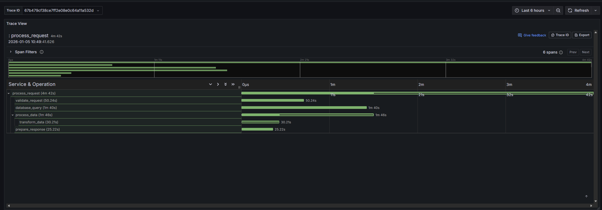

# Sending Traces With Logs

Collector does not currently have native support for consuming traces, but traces can be considered a special form of logging. Until native support is created, we support sending spans via OTLP/HTTP log messages to collector instances, then parsing and reading them using the ADX Plugin within Grafana and Trace views.

## Prerequisites

This example assumes you have Collector running using the quick-start. This example generates Spans and Traces with the standard OTel libraries, then sends them as OTel Logs via the Collector [otel-log OTLP/HTTP](../config.md#otel-log) endpoint.

The exported logs are configured with the attributes `kusto.database = Logs` and `kusto.table = Traces` to send all traces to a common `Traces` destination table in the `Logs` database.

### Database Setup

Ensure you have a `Logs` database created in your ADX cluster with a `Traces` table. The table will be created automatically by the ingestor if it doesn't exist, based on the schema of the incoming log data.

## Collection and Sending

The [example code](https://github.com/Azure/adx-mon/tree/main/docs/examples/python-trace-to-log) uses the Python OTel SDK to generate traces and forward them to Collector.

```bash
# Navigate to the example directory
cd docs/examples/python-trace-to-log

# Install Python dependencies
pip install -r requirements.txt

# Select a collector instance and port-forward (excluding singleton collector)
COLLECTOR_POD=$(kubectl get pods -n adx-mon -l adxmon=collector --no-headers | grep -v 'singleton' | head -n 1 | awk '{print $1}')
echo "Port-forwarding to collector pod: $COLLECTOR_POD"
kubectl port-forward -n adx-mon $COLLECTOR_POD 9091:8080 &

# Wait a moment for port-forward to establish
sleep 2

# Run the trace generator
make run
```

After running the example, check the `Traces` table in your ADX `Logs` database. Note that data will appear after the default 5-minute Kusto `ingestionbatching` policy delay.

### Exported Log Format

To match a similar format to the stdout exporter in some SDKs, the OTel log `Body` field is a map with the following format. The `Body` should be a dict instead of serialized `json`.

```json
{
	"SpanContext": {
		"SpanID": "4208d469cd04f158",
		"TraceFlags": "01",
		"TraceID": "e575f08a72bc914a309d525cfda42e6d"
	},
	"StartTime": "2026-01-06T03:45:16.8687599Z",
	"Attributes": {
		"validator": "schema_v1"
	},
	"Name": "validate_request",
	"SpanKind": "INTERNAL",
	"EndTime": "2026-01-06T03:45:16.9191787Z",
	"Parent": {
		"SpanID": "a9331e448a37e860",
		"TraceFlags": "01",
		"TraceID": "e575f08a72bc914a309d525cfda42e6d"
	},
	"Events": [
		{
			"Attributes": {
				"valid": true
			},
			"Name": "validation_complete",
			"Time": "2026-01-06T03:45:16.9191276Z"
		}
	],
	"Status": {
		"Code": "UNSET",
		"Description": ""
	},
	"Resource": {
		"service.name": "python-trace-example",
		"service.version": "1.0.0",
		"telemetry.sdk.language": "python",
		"telemetry.sdk.name": "opentelemetry",
		"telemetry.sdk.version": "1.39.1"
	}
}
```

## Viewing

Grafana has a [Traces](https://grafana.com/docs/grafana/latest/visualizations/panels-visualizations/visualizations/traces/) panel that can render the results of a trace with associated spans. In combination with the [Azure Data Explorer data source](https://grafana.com/grafana/plugins/grafana-azure-data-explorer-datasource/), we can query ADX and visualize traces. To render properly, Grafana expects a set of rows with a single common `traceId` and specific schema. 

The example queries below assume your traces are sent to a `Traces` table and the dashboard has a `traceID` variable defined as described in the Grafana Traces documentation.



### Query to populate values for traceID variable
```kql
Traces
| where $__timeFilter(Timestamp)
| distinct tostring(Body.SpanContext.TraceID)
```

### Query to get set of spans for a given traceID
```kql
Traces
| where $__timeFilter(Timestamp)
| extend trace = Body
| extend spanContext = trace.SpanContext
| extend parent = trace.Parent
| extend resource = trace.Resource
| where tostring(spanContext.TraceID) == "$traceID"
| extend attributes = trace.Attributes
| project 
    timestamp = Timestamp,
    traceID = tostring(spanContext.TraceID),
    spanID = tostring(spanContext.SpanID),
    parentSpanID = tostring(parent.SpanID),
    serviceName = tostring(resource["service.name"]),
    operationName = tostring(trace.Name),
    startTime = todatetime(trace.StartTime),
    duration = datetime_diff('microsecond', todatetime(trace.EndTime), todatetime(trace.StartTime))
```