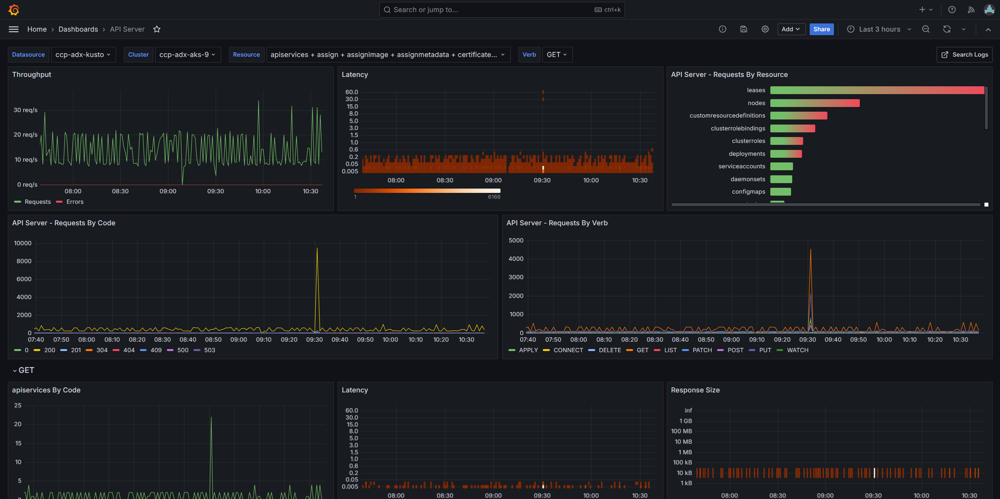
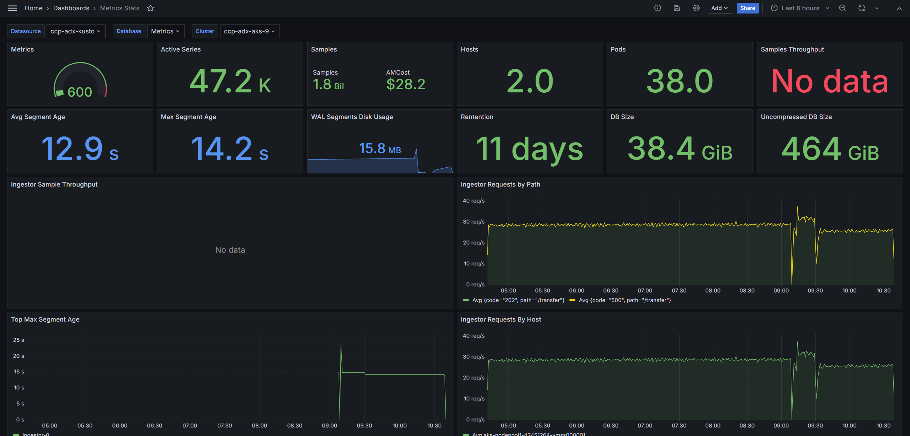
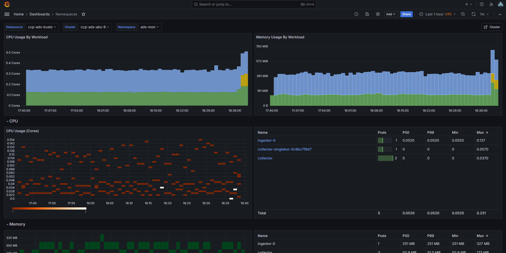
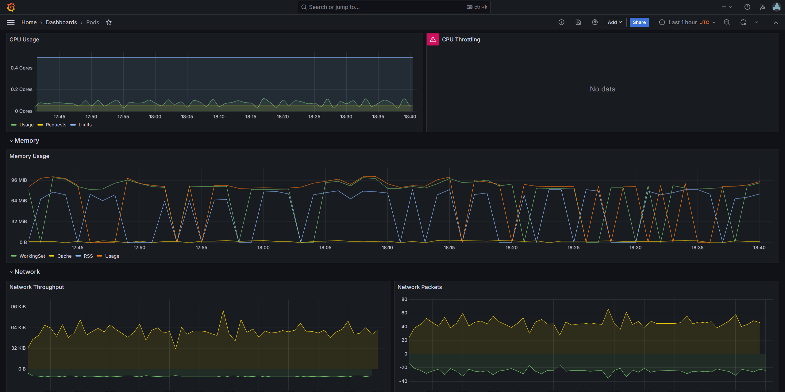

# Quick Start

This guide will deploy ADX-Mon on an Azure Kubernetes Service (AKS) cluster and send collected telemetry
to an Azure Data Explorer cluster.  It will deploy all components within the cluster and demonstrate 
how to enable telemetry collection on a pod and query it from Azure Data Explorer.

## Pre-Requisites

You will need the following to complete this guide.

* An AKS cluster
* An Azure Data Explorer cluster
* A Linux environment with Azure CLI installed

These clusters should be in the same region for this guid.  You should have full admin access to both clusters.

## Deploy ADX-Mon

```sh
bash <(curl -s  https://raw.githubusercontent.com/Azure/adx-mon/main/build/k8s/bundle.sh)
```

This script will prompt you for the name or you AKS and ADX cluster and configure them to accept telemetry from ADX-Mon
components. It configures the provided ADX cluster with `Metrics` and `Logs` databases and deploy the Collector and Ingestor services to begin collecting and shipping data from the AKS cluster.

## Enable the Ingestor Autoscaler (optional)

The operator deploys a single ingestor replica by default. To let the control plane resize the StatefulSet based on CPU
utilization, enable the autoscaler on the `Ingestor` custom resource:

```sh
kubectl -n adx-mon patch ingestors.adx-mon.azure.com adx-mon --type merge -p '
spec:
  autoscaler:
    enabled: true
    minReplicas: 2
    maxReplicas: 10
    scaleUpCPUThreshold: 70
    scaleDownCPUThreshold: 40
    scaleInterval: 5m
    cpuWindow: 15m
    scaleUpBasePercent: 25
    scaleUpCapPerCycle: 4
'
```

This command keeps the original manifest intact and only updates the autoscaler block. You can inspect the latest
decision with `kubectl -n adx-mon get ingestor adx-mon -o yaml | less`. The autoscaler requires the Kubernetes Metrics
Server (or any implementation of the `metrics.k8s.io` API) to be installed in the cluster.

## Annotate Your Pods

Telemetry can be ingested into ADX-Mon by annotating your pods with the appropriate annotations or shipping it through
OTEL endpoints.  The simplest model is to annotate your pods with the appropriate annotations.

### Metrics

ADX-Mon collector support scraping Prometheus style endpoints directly. To enable this, annotate your pods with these annotations, configuring the port and path to match the port and http path for the metrics endpoint of your service.

Prometheus metric names will be transformed from `snake_case` to `TitleCase`. As an example, `adxmon_collector_logs_sent` is transformed into `AdxmonCollectorLogsSent` when sent to Kusto.

```yaml
adx-mon/scrape: "true"
adx-mon/port: "8080"      # Can use numeric ports
adx-mon/path: "/metrics"
```

You can also use **named ports** for better readability:

```yaml
adx-mon/scrape: "true"
adx-mon/port: "metrics"   # Use the named port from your container spec
adx-mon/path: "/metrics"
```

For multiple endpoints, use the `targets` annotation:

```yaml
adx-mon/scrape: "true"
# Mix named and numeric ports as needed
adx-mon/targets: "/metrics:metrics,/health:9000"
```

### Logs

ADX-Mon collector supports discovering logs from pods. To configure the destination Kusto table, annotate your pod with `adx-mon/log-destination` with a value of `DBName:TableName`.

By default, collector parses each log line as plaintext, but an optional list of log-parsers can be defined as a comma separated list. It currently supports json-formatted log lines in addition to plaintext.

```yaml
adx-mon/scrape: "true"
adx-mon/log-destination: "Logs:Collector"
adx-mon/log-parsers: json
```

## Query Your Data

After bootstrapping, the provided ADX cluster will begin to populate with metrics and logs. The `Metrics` database is configured with a default `30s` batch latency for ADX ingestion to optimize for latency, while `Logs` is configured with a default of `5m` to optimize for throughput.

### Metric Examples

```kql
// Process a prometheus-style counter to determine the number of logs sent by a given source in Collector in the last hour
AdxmonCollectorLogsSent
| where Timestamp > ago(1h)
// convert from point-in-time count to amount of increase per interval
| invoke prom_delta()
| summarize TotalSent=sum(Value) by Host=tostring(Labels.host), Source=tostring(Labels.source)
```

### Log Examples

```kql
// Get all non-info logs from Collector from the last hour
Collector
| where Timestamp > ago(1h)
| where Body.lvl != "INF"
| project Timestamp, Level=Body.lvl, Msg=Body.msg, Pod=Resource.pod, Host=Resource.host
```

```kql
// Graph the number of container creations every 15 minutes over the last day, per Host and Cluster
let _lookback=ago(1d);
Kubelet
| where Timestamp > _lookback
| where Body.message contains "Syncloop ADD"
| make-series Creations=count() default=0 on Timestamp from _lookback to now() step 15m by Host=tostring(Resource.host), Cluster=tostring(Resource.cluster)
| render timechart 
```

## Setup Dashboards

Any ADX compatible visualization tool can be used to visualize collected telemetry. ADX Dashboards is a simple solution that is native to ADX. You can also use Azure Managed Grafana with the Azure Data Explorer datasource to leverage Grafana's powerful visualization capabilities.

### Azure Managed Grafana via quick-start script

As part of the quick-start script, one can set up an Azure Managed Grafana (AMG) instance. After configuring ADX-Mon on the AKS cluster the script will prompt you about it, and you can provide the name of an existing Grafana instance you have access to or decide to create one.
You will also be prompted about importing pre-built dashboards to monitor the AKS cluster.

> Note: The script tries to create the AMG instance in the same resource group as the ADX cluster. 

Here's a glimpse of what comes as part of the pre-built dashboards:
#### API Server

#### Cluster Info

#### Metrics Stats

#### Namespaces

#### Pods
