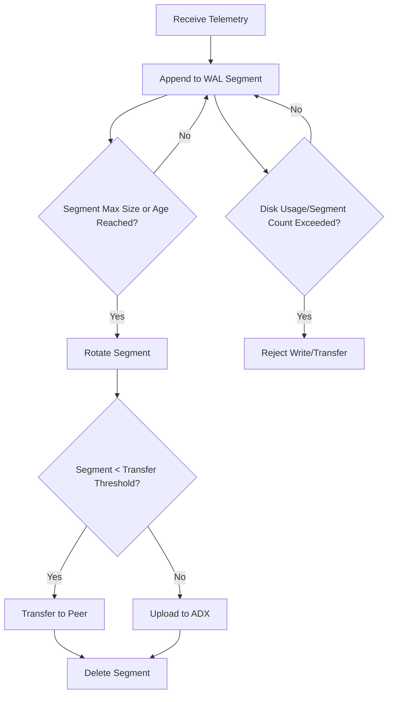

# Ingestor WAL Storage Management and Backpressure

## Overview

The Ingestor component of ADX-Mon is responsible for reliably buffering, batching, and uploading telemetry data (metrics, logs, traces) to Azure Data Explorer (ADX). To ensure durability and high throughput, Ingestor uses a Write-Ahead Log (WAL) mechanism, writing all incoming data to disk before upload. This document details how Ingestor manages WAL files, prevents storage exhaustion, and applies backpressure to maintain system stability.

---

## WAL Segment Lifecycle

### 1. WAL Segments per Table/Schema
- Each unique table/schema combination gets its own WAL segment file.
- Incoming telemetry is appended to the appropriate segment.

### 2. Segment Rotation
- Segments are rotated (closed and a new one started) when either:
  - **Max Segment Size** is reached (e.g., 100MB–1GB, configurable)
  - **Max Segment Age** is reached (e.g., 5 minutes, configurable)
- Rotation is triggered both on write and by a background goroutine (periodic check).

### 3. Segment Handling After Rotation
- **Small segments** (below a threshold, e.g., <100MB) are transferred to a peer Ingestor for coalescing.
- **Large or old segments** are uploaded directly to ADX.
- If peer transfer fails, the segment is uploaded directly.

### 4. Upload and Cleanup
- Segments are compressed and uploaded in batches to ADX.
- After successful upload or transfer, segments are deleted from local storage.

---

## Storage Limits and Backpressure

### Configurable Limits
- **Max Disk Usage**: Total bytes allowed for all WAL segments, including:
  - All closed segments (on disk)
  - The active (open) segment
  - Any in-flight (not yet flushed) writes buffered in memory
- **Max Segment Count**: Maximum number of WAL segments allowed on disk.

### Enforcement
- On every write, Ingestor checks if adding data would exceed disk usage or segment count limits.
- **Disk usage enforcement is comprehensive:**
  - The system sums the size of all closed segments, the current active segment, and all in-flight (buffered, not yet flushed) writes.
  - This ensures that even data not yet persisted to disk is accounted for, preventing storage overcommitment.
- If limits are exceeded:
  - **Writes are rejected** with errors (e.g., `ErrMaxDiskUsageExceeded`, `ErrMaxSegmentsExceeded`).
  - **Transfers from peers** are also rejected with HTTP 429 (Too Many Requests).
- This backpressure propagates upstream, signaling senders to slow down or retry later.

### Empty Segment Cleanup
- Segments with only the magic header (no data) are deleted to avoid uploading empty files.

---

## WAL Segment Rotation and Backpressure: Flow Diagram

---

## Key Code Mechanisms

- **Rotation**: `rotateSegmentIfNecessary()` in `pkg/wal/wal.go` handles segment rotation and cleanup.
- **Backpressure**: `validateLimits()` in `pkg/wal/wal.go` checks disk usage and segment count before writes.
- **Segment Transfer/Upload**: Logic in `ingestor/cluster/batcher.go` and `ingestor/adx/uploader.go` manages peer transfer and ADX upload.
- **Cleanup**: Segments are deleted after upload/transfer; empty segments are removed on startup.

---

## Configuration

- Limits and thresholds are set via CLI flags and/or Ingestor CRD fields:
  - `--storage-dir`: Directory for WAL files (required)
  - `--max-disk-usage`: Max bytes for WAL storage (**default: 10 GiB if unset**)
  - `--max-segment-count`: Max number of WAL segments (**default: 10,000 if unset**)
  - `--max-segment-size`: Max size per segment
  - `--max-segment-age`: Max age per segment
  - `--max-transfer-age`: Max age for peer transfer
  - `--enable-wal-fsync`: Enable fsync for durability

> **Note:**
> - **Ingestor** defaults to a maximum disk usage of **10 GiB** (`--max-disk-usage=10*1024*1024*1024`) if not set.
> - **Collector** defaults to **unlimited** disk usage (`max-disk-usage=0`) if not set. You must explicitly set a limit to prevent disk exhaustion.

---

## References
- [WAL Segment File Format](concepts.md#wal-segment-file-format)
- [Ingestor Data Flow](ingestor.md#data-flow)
- [Azure Data Explorer Ingestion Best Practices](https://docs.microsoft.com/en-us/azure/data-explorer/ingest-best-practices)

---

## Summary Table

| Mechanism         | Purpose                                 | Triggered By                |
|-------------------|-----------------------------------------|-----------------------------|
| WAL Write         | Durability, batching                    | Every telemetry write       |
| Segment Rotation  | Batching, upload/transfer optimization  | Max size/age, periodic task |
| Peer Transfer     | Coalescing small files                  | Segment < threshold         |
| Direct Upload     | Timely upload, fallback                 | Segment large/old/transfer fail |
| Cleanup           | Free disk, prevent storage exhaustion   | After upload/transfer       |
| Backpressure      | Prevent disk exhaustion, signal overload| On write/transfer if limits exceeded |

---

## Example: WAL Segment Lifecycle

1. Telemetry arrives and is appended to the WAL segment for its table/schema.
2. When the segment reaches max size or age, it is rotated.
3. If the segment is small, it is transferred to a peer for coalescing; otherwise, it is uploaded directly to ADX.
4. After upload/transfer, the segment is deleted from disk.
5. If disk usage or segment count limits are exceeded, new writes/transfers are rejected until space is freed.

---

# Collector Storage Mechanism and Limit Enforcement

## Shared WAL Storage Layer

Collector uses the same WAL (Write-Ahead Log) and storage implementation as Ingestor. This means:
- All incoming telemetry is written to disk using the same durable, append-only WAL segment format.
- Segment rotation, batching, and cleanup logic are identical to Ingestor.
- The same enforcement logic for disk usage and segment count is available, but must be explicitly configured.

## Configuration

- **Collector supports the same storage-related configuration options as Ingestor:**
  - `max-disk-usage`: Maximum total bytes allowed for all WAL segments (default: unlimited if unset or 0)
  - `max-segment-count`: Maximum number of WAL segments allowed on disk (default: unlimited if unset or 0)
  - `max-segment-size`: Maximum size per WAL segment
  - `max-segment-age`: Maximum age per WAL segment
  - `storage-dir`: Directory for WAL files
- If `max-disk-usage` and `max-segment-count` are not set, Collector will not enforce any total storage limit and can fill the disk.

## Enforcement and Behavior on Limit Exceedance

- **When limits are set:**
  - The WAL layer will reject new writes if adding data would exceed the configured disk usage or segment count.
  - Collector will drop any telemetry data it cannot persist to the WAL due to these errors.
  - There is no upstream backpressure: Collector does not signal Prometheus or other scrapers to slow down; it simply drops data that cannot be written.
  - No HTTP 429 or similar error is sent to remote write clients; data loss is silent except for logs/metrics.
- **When limits are not set:**
  - Collector will continue writing WAL files until the disk is physically full, potentially causing node instability.

## Recommendations

- Always set `max-disk-usage` and/or `max-segment-count` in Collector's configuration to prevent disk exhaustion.
- Monitor Collector logs and metrics for dropped data due to storage limits.

## Summary Table: Collector vs Ingestor

| Mechanism         | Ingestor Behavior                                    | Collector Behavior                |
|-------------------|------------------------------------------------------|-----------------------------------|
| WAL Write         | Durable, batched, WAL                                | Durable, batched, WAL             |
| Limit Enforcement | Rejects writes, HTTP 429 to peers                    | Drops data, no upstream signal    |
| Backpressure      | Propagates to senders/peers                          | No backpressure, silent data loss |
| Config Defaults   | 10 GiB disk, 10,000 segments if unset                | Unlimited if unset                |

---

## Example: WAL Segment Lifecycle

1. Telemetry arrives and is appended to the WAL segment for its table/schema.
2. When the segment reaches max size or age, it is rotated.
3. If the segment is small, it is transferred to a peer for coalescing; otherwise, it is uploaded directly to ADX.
4. After upload/transfer, the segment is deleted from disk.
5. If disk usage or segment count limits are exceeded, new writes/transfers are rejected until space is freed.

---

For further details, see the code in `pkg/wal/`, `storage/`, and `ingestor/` directories.
